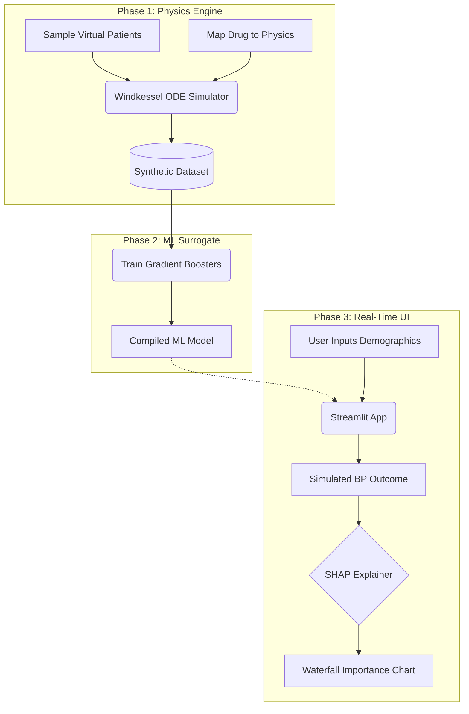

# Comprehensive Project Guide & Presentation Materials
**A Data Driven Digital Twin Framework for Modelling Patient-Specific Cardiovascular Drug Response**

This document serves as the ultimate manual for the project. It provides deep scientific context, an exhaustive page-by-page breakdown of the Streamlit website, and a slide-by-slide structure meant directly for Powerpoint/Live Demo presentations.

---

## 1. Proposed Methodology: The Deep Science & Theory Behind Everything

### The Core Concept: What is a "Digital Twin"?
Simply put, a Digital Twin is a highly accurate virtual model of a physical object. Originally used by NASA to model spacecraft, the concept has moved to healthcare as the "Digital Patient." If a clinician wants to know "What happens if I give this specific patient a massive dose of a powerful Vasodilator?", they can simulate it on the Digital Twin first, eliminating the risk of an adverse real-world reaction.

### Why a "Surrogate" Twin?
True biophysical models of the human heart (like running 3D fluid dynamics or solving complex Navier-Stokes equations for blood flow) take supercomputers agonizing hours to process just a few heartbeats. This is useless for a doctor in a clinic.

To make this usable in a web application, we use a **Machine Learning Surrogate Model**. We let the slow mathematical equations generate thousands of examples offline on a server. Then, we train a fast, lightweight Artificial Intelligence (Gradient Boosting) model on those examples. The AI "memorizes" and maps the complex physics. Now, when a user asks a question, the AI predicts the answer in 0.05 seconds. It is a "surrogate" for the heavy math.

### System Architecture Flowchart
To visualize how we solved this problem, the pipeline is split into three distinct phases: **Generation** (Physics), **Modeling** (AI), and **Application** (The UI).

### The Windkessel Model (The Underlying Physics)
The project utilizes the 2-Element Windkessel model. This is an established biophysics model that cleverly compares blood flow to an electrical circuit:
*   **Voltage** = Blood Pressure.
*   **Current** = Blood Flow (Cardiac Output, $Q$). The pump of the heart.
*   **Resistor** = Blood Vessels (Systemic Vascular Resistance, $R$). The friction of the blood against restricted pipe walls.
*   **Capacitor** = Artery Elasticity (Arterial Compliance, $C$). The "stretchiness" of the aorta acting as a buffer.

**How Interventions Work:**
When we simulate a drug, we aren't using chemical formulas. We map the drug directly to the Windkessel physics:
*   *Vasodilators* expand blood vessels. In physics, this means decreasing $R$ (Resistance).
*   *Beta Blockers* slow the heart and reduce contraction force. In physics, this means decreasing $Q$ (Cardiac Output).
*   *Stimulants* increase heart rate and narrow vessels. This increases both $Q$ and $R$.

### The Explainable AI (SHAP Theory)
AI is heavily criticized as a "Black Box" (data goes in, an answer comes out, but nobody knows the logic). Doctors cannot prescribe medication based on a Black Box.

We solve this using **SHAP** (SHapley Additive exPlanations), a concept derived from cooperative game theory (specifically, Lloyd Shapley's 1953 theories on how to fairly distribute payout among players in a coalition).
*   In our model, the "game" is the blood pressure prediction.
*   The "players" are the patient's features (Age, Heart Rate, Drug Class, Dosage).
*   SHAP calculates the exact marginal contribution of every single feature. It breaks down the math: "The Beta Blocker caused $-12$ mmHg, but the patient's High Risk status resisted and caused $+2$ mmHg."

---

## 2. Exhaustive Website & UI Navigation Guide

When you boot the application using `streamlit run ui/app.py`, you are greeted by an interactive dashboard structured into distinct functional tabs.

### The Sidebar (Global Controls)
The sidebar remains persistent across all pages, representing the "State" of the Digital Twin.
*   **Theme Toggle (`🌞 Light Mode / 🌙 Dark Mode`)**: Instantly overrides CSS to swap the UI theme. Ideal for matching the specific lighting of a presentation classroom or projector.
*   **Version Toggle (The ML Defense)**:
    *   `V1: Synthetic`: Runs clean math. Shows exact predictions without noise. Perfect for analyzing the pure AI behavior.
    *   `V2: Real-World Grounded`: Simulates biological reality. Injects statistical noise derived from real Kaggle datasets and runs the math 30 times (Bootstrap sampling) to calculate a realistic "Confidence Interval" (e.g., $120 \pm 2$ mmHg).
*   **Patient Profile sliders**: Adjust the virtual patient's current theoretical state: Age, Baseline Systolic BP, Baseline Diastolic BP, and Heart Rate.
*   **Intervention Selection**: Pick the drug class (Beta Blocker, Vasodilator, etc.) and the dosage multiplier to administer. *Note: "Custom/Investigational" allows you to directly manipulate the Windkessel R, C, Q physics multipliers instead of using a predefined drug class.*

### Tab 1: Simulation Panel (The Core Tool)
This is the primary workspace. When you click "Run Simulation", the UI executes three distinct modules:
1.  **Context Engine**: Evaluates the baseline vitals and outputs warnings if they are already dangerously high.
2.  **Simulation Engine**: Displays a massive "Before $\rightarrow$ After" interface. It features dynamic, responsive bar charts (using `Plotly`) that visually drop or rise based on the drug. It also includes an automated text parser that generates a **Stability Assessment** (e.g., warning the user if the predicted effect is "Extreme" and mathematically risky).
3.  **Explainability (SHAP) Engine**: Renders the Waterfall charts. Blue bars push the prediction down, Red bars push the prediction up. An automated NLP parser writes a clinical interpretation of the chart in plain English.

### Tab 2: Treatment Optimizer (The Solution Searcher)
Instead of forcing the user to trial-and-error different dosage sliders in the Simulation tab, the Treatment Optimizer automates the process.
*   **How it works**: The user inputs a "Target Blood Pressure" they wish the patient to reach safely.
*   **The Search**: The engine spins up a background grid search, simulating over 100 combinations of all available drug classes and dosages in less than a second. 
*   **The Output**: It returns the mathematically optimal, safest treatment to reach the goal. It ranks alternative treatments and visualizes the comparisons in a scatter/bar plot combo, ensuring the user has multiple clinical options.

### Tab 3: Metrics & Validation (The Data Science Proof)
This tab is for the data scientists evaluating the AI.
*   Displays the real-time accuracy of the Surrogate Twin against the original physics data. 
*   Features an interactive **R-squared Hexbin Plot** and detailed tables of Mean Absolute Error (MAE) for both Systolic and Diastolic predictions. This proves the AI isn't guessing; it physically learned the equations perfectly.

### Tab 4: Methodology / Transparency (The Education Portal)
A deep-dive technical reference.
*   Includes full LaTeX math equation breakdowns of the 2-Element Windkessel model.
*   Features a "Readiness Scorecard" and strict Disclaimers outlining what datasets were used. It explicitly clarifies that this is a research simulation using synthetic data, preventing any false claims of clinical readiness.

---

## 3. Future Scope and Limitations

It is critical during presentations and deployment to clarify the boundaries of the Digital Twin.

### Limitations to Acknowledge
1.  **Synthetic Abstraction**: We are predicting based on a physics engine's representation of a human, not a real human. The physics engine (2-Element Windkessel) is a simplified electrical circuit. It ignores complex biological reflexes (like adrenaline spikes when BP drops).
2.  **No Time Dimension**: The UI predicts the *final* blood pressure. It does not predict if it will take 10 minutes or 10 hours to reach that pressure.
3.  **Strictly Cardiovascular**: The model assumes the rest of the body is perfectly healthy. It does not account for kidney failure or lung disease acting as confounding variables.

### The Future Roadmap
1.  **Real Hospital Data**: Swapping the "Synthetic Data Generator" for raw Electronic Health Records (EHR) databases like MIMIC-IV. The ML model would then learn the true statistical outcomes of real patients, not just physics equations.
2.  **Deep Learning Integration**: Moving from `scikit-learn` algorithms to Recurrent Neural Networks (RNNs). This will allow the UI to map the patient's blood pressure continuously over time on a line graph, rather than just showing a Before/After bar chart.
3.  **Expanded Physics**: Upgrading the core simulator to include full-body hemodynamics (tracking blood flow to specific organs like the brain).

---

## 4. Presentation Ready PPT Outline

If you need to present this project (e.g., Powerpoint slides), use this structured narrative flow and do a live demo alongside it.

### Slide 1: Title & Hook
*   **Title**: A Data Driven Digital Twin Framework for Modelling Patient-Specific Cardiovascular Drug Response.
*   **Subtitle**: Machine Learning for Personalized What-If Scenario Analysis.
*   **The Hook**: "What if we could safely test high-risk cardiovascular interventions on a virtual replica of a patient before ever administering the drug to the human?"

### Slide 2: The Problem
*   Current biophysical simulators (fluid dynamics) are brilliant, but computationally agonizing. They are impossible to use in real-time clinical workflows.
*   Modern AI models are incredibly fast, but they are "Black Boxes" that doctors fundamentally cannot trust.

### Slide 3: Our Solution (The 3-Step Architecture)
*   *Visual point*: Show or explain the 3-step pipeline.
*   **Step 1:** Use the proven mathematical Windkessel mechanics to generate massive amounts of physics-based synthetic physiological data.
*   **Step 2:** Train a blazing fast Machine Learning "Surrogate" Twin on that dataset to memorize the physics.
*   **Step 3:** Wrap the ML model in SHAP Game Theory algorithms to make every single prediction 100% explainable and transparent.

### Slide 4: Real-Time Simulation (Live Demo Point 1)
*   *Talking Point*: "Let's look at the UI. We model the human heart like an electrical circuit (Windkessel)."
*   *Live Demo*: Open the UI "Simulation" tab. Adjust the patient sliders to make them hypertensive ($160/100$ BP). Administer a Beta Blocker. Click run and watch the UI instantly predict the blood pressure drop in the Plotly charts.

### Slide 5: Unboxing the Black Box (Live Demo Point 2)
*   *Talking Point*: "Doctors don't just need a number, they need to know *why* the AI generated that number."
*   *Live Demo*: Scroll down to the SHAP Waterfall chart. Explain the horizontal bars. "As you can see, the prediction wasn't random. The AI clearly heavily weighted the dosage (blue bar) to lower the BP, while the patient's baseline severity pushed back against the drug (red bar)."

### Slide 6: Defending the Math: V1 vs V2 (Live Demo Point 3)
*   *Talking Point*: "A major critique of synthetic AI is that it's too 'clean'. Math is perfect, but biology is messy and unpredictable."
*   *Live Demo*: Toggle the sidebar from V1 to `V2: Real-World Grounded`. "We injected statistical human noise distributions from Kaggle into the inputs. Click run again." Show that the UI now outputs $\pm$ uncertainty ranges by running 30 simultaneous bootstrap simulations. Point out the Confidence Score indicator.

### Slide 7: Automated Treatment Optimization (Live Demo Point 4)
*   *Talking Point*: "Instead of making the doctor guess the slider values via trial and error, let the machine search the entire physical solution space."
*   *Live Demo*: Go to the `Treatment Optimizer` tab. Set a target BP. Click the button. "The application just simulated 120 alternative pharmacological scenarios in a fraction of a second to mathematically rank the safest, most effective treatment path."

### Slide 8: Conclusion & Future Scope
*   **Summary**: We successfully bridged slow biophysics and fast AI, creating an interactive, transparent tool.
*   **Future Scope**:
    *   **Data**: Transitioning from Synthetic Windkessel data to Real Electronic Health Records (EHR) from hospital networks.
    *   **Tech**: Upgrading to Recurrent Neural Networks for minute-by-minute time-series forecasting.
*   **Limitations to Transparency**: Acknowledge that the system is an abstracted physics surrogate, currently isolating the heart and ignoring full systemic feedback loops.

---
*End of Document*
