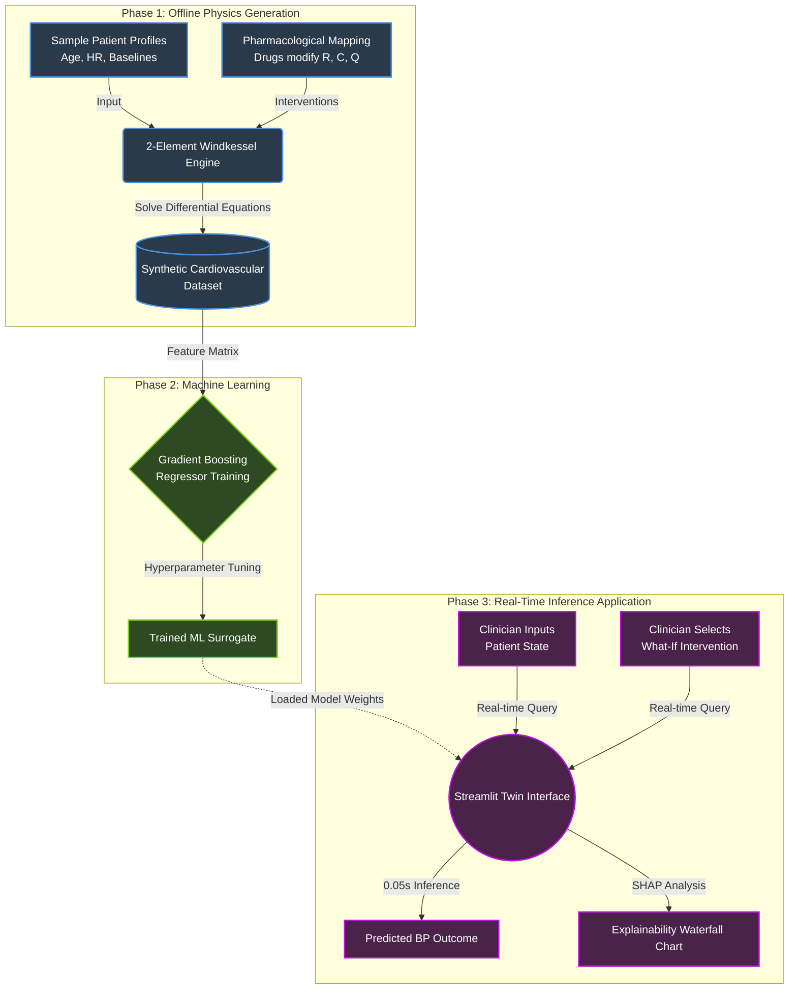

# A Data Driven Digital Twin Framework for Modelling Patient-Specific Cardiovascular Drug Response

## 1. Abstract
The Cardiovascular Digital Twin is an advanced, physiology-inspired research platform designed to simulate and analyze patient-specific cardiovascular responses to various pharmacological interventions. By bridging the gap between slow, deterministic biophysical models and fast, data-driven artificial intelligence, this project introduces a Machine Learning (ML) surrogate model capable of real-time, personalized "what-if" scenario analysis. Leveraging the canonical 2-Element Windkessel model to generate robust synthetic physiological data, the system trains a Multi-Output Gradient Boosting Regressor to map patient baseline profiles to drug-induced blood pressure alterations. 

To ensure clinical relevance and trustworthiness, the architecture heavily integrates Explainable AI (XAI) via SHapley Additive exPlanations (SHAP), providing transparent, feature-level insights into the model's predictions. The project fundamentally explores the transition from clean, theoretical environments (Version 1) to robust, noise-injected environments that account for real-world biological variability and statistical uncertainty (Version 2). The result is an interactive, explainable, and highly scalable Streamlit framework that demonstrates the vast potential of Surrogate Digital Twin technology in precision medicine and personalized treatment optimization.

## 2. Introduction
Digital Twins—virtual replicas of physical systems—have revolutionized fields from aerospace engineering to advanced manufacturing. In healthcare, the concept of a "Digital Patient" offers the unprecedented ability to simulate clinical trajectories without risking patient safety. Exploring multiple treatment paths simultaneously on a computer is vastly superior to the traditional clinical approach of "trial-and-error" prescription.

However, traditional biophysical models (such as 3D fluid dynamics simulations of the heart or complex differential equation solvers) are computationally intensive. They are often mathematically complex, highly constrained, and take far too long to compute for them to be used seamlessly in a fast-paced clinical workflow or real-time web application. 

This project addresses this computational bottleneck by developing a **Surrogate Digital Twin**. Instead of running heavy differential equations for every single user query, we use the deterministic biophysical models offline to generate a massive, robust synthetic dataset that represents varying human physiologies under different drug effects. We then train a fast, reliable Machine Learning model on this rich dataset. The resulting application acts as a "surrogate" for the physics engine—predicting the physiological outcomes of specific drug interventions (e.g., administering a Beta Blocker or Vasodilator) in milliseconds. Crucially, the system also explains *why* the prediction was made, addressing the "black box" criticism that has historically prevented the adoption of AI in critical healthcare settings.

## 3. Project Objectives
The primary goals of this comprehensive project are:

1. **Develop a Physiology-Inspired ML Surrogate**: Successfully transition from slow, deterministic mathematical models (Windkessel Ordinary Differential Equations) to instantaneous Machine Learning predictions without sacrificing the underlying anatomical and biophysical grounding.
2. **Enable Personalized "What-If" Analysis**: Build an interface that allows users to input highly specific, unique patient baselines (Age, Systolic/Diastolic Blood Pressure, Heart Rate, Risk Group) and instantly simulate the cardiovascular outcome of various drug classes and dosages.
3. **Implement Real-Time Explainable AI (XAI)**: Prove that AI does not have to be a black box. Use SHAP (SHapley Additive exPlanations) explainers to break down predictive outputs, showing exactly how much each patient feature (e.g., baseline SBP, dosage amount, heart rate) mathematically contributed to the final simulated outcome.
4. **Defend the ML Approach via V1/V2 Versioning**: Explicitly demonstrate the necessity of modeling real-world noise. Move beyond clean, theoretical deterministic predictions (Version 1: Synthetic) to incorporate real-world biological noise and statistical uncertainty modeling derived from Kaggle statistics (Version 2: Real-World Grounded).
5. **Develop an Exhaustive Treatment Optimizer**: Create a search heuristic that can scan through over 100 possible drug/dosage combinations in real-time to return the safest, most effective treatment plan for a specific patient.
6. **Provide a Professional User Interface**: Develop a modular, interactive Streamlit dashboard that visualizes the data cleanly, tailored specifically for research discussion, clinical presentation, and educational demonstration.

## 4. Proposed Methodology: Biological & Biophysical Grounding

The digital twin problem is defined by the inability to rapidly run differential equations in clinical settings. Our methodology solves this by separating the physics generation from the real-time prediction interface.

### 4.1 Architecture Flowchart
The following diagram illustrates the sequential data and logic flow of the project framework:

To build a Digital Twin, the AI must learn from the physics of the human body, not just random statistical correlations. 

### 4.1 The Physiology Engine: 2-Element Windkessel Model
At the core of our data generation lies the 2-Element Windkessel Model. Originally formulated by Otto Frank in 1899, this is a classic biophysical representation of the human arterial system. The model cleverly abstracts the heart and arteries using electrical circuit analogs:
* **Resistance ($R$)**: Represents *Systemic Vascular Resistance*. This is the friction of blood rubbing against the walls of the blood vessels. Biologically, constricted vessels have high resistance, while dilated vessels have low resistance.
* **Compliance ($C$)**: Represents *Arterial Compliance*. This is the elasticity or "stretchiness" of the arteries. Biologically, a young, healthy aorta acts like a balloon, taking in blood and slowly releasing it (high compliance). An older, stiff artery cannot stretch well (low compliance).
* **Cardiac Output ($Q$)**: Represents the total volume of blood flow pumped by the heart per minute.

By solving the differential equations governing this "circuit" over a simulated heartbeat cycle, the engine calculates the baseline Systolic (SBP - the peak pressure during a heartbeat) and Diastolic (DBP - the resting pressure between beats) blood pressures for a simulated human.

### 4.2 Biological Representation of Drug Interventions
When a drug is administered in our simulation, it does not physically exist as a chemical interactant. Instead, we map the known pharmacological mechanism of action directly to the Windkessel physics parameters:
* **Vasodilators (e.g., Amlodipine)**: These drugs relax the smooth muscles in blood vessels, causing them to widen. In our physics model, this is mathematically represented as a significant decrease in Vascular Resistance ($R$).
* **Beta Blockers (e.g., Atenolol)**: These drugs block the effects of adrenaline, slowing the heart rate and reducing the force of contraction. In our physics model, this is mapped as a decrease in Cardiac Output ($Q$) and a slight alteration in Compliance ($C$).
* **Stimulants**: These increase heart rate and constrict blood vessels. Mathematically, this maps to an increase in both $Q$ and $R$.
* **Volume Expanders**: These introduce more fluid into the bloodstream, directly increasing $Q$.

The Windkessel model processes these shifted foundational parameters through its ODE solver to output the new, post-intervention blood pressure.

## 5. Proposed Methodology: Machine Learning & Surrogate AI

Because real patient data is heavily protected by HIPAA and often lacks strictly controlled, isolated intervention markers (where only one drug changes and nothing else), we use the Windkessel model to generate a massive synthetic dataset.

### 5.1 Dataset Generation
We synthesize thousands of distinct "patient profiles." The generator samples normal and abnormal distributions of Age, baseline vitals, and overarching Risk Groups (which apply modifier weights). It then applies the aforementioned drug interventions at varying dosage multipliers ($0.5x, 1.0x, 1.5x, 2.0x, 2.5x$).

### 5.2 Training the Digital Twin
The resulting complex synthetic dataset (composed of pairs of: `[Patient Profile + Drug Details] -> [New Blood Pressure Outcome]`) is used to train a **Multi-Output Gradient Boosting Regressor** (via the `scikit-learn` ecosystem). 
* This ML model acts as the "Surrogate Twin." It learns the complex, non-linear mathematical mappings of the Windkessel ODEs across a vast hyperdimensional space.
* In the application, when a clinician queries a "what-if" scenario, the fast ML model predicts the outcome in milliseconds, entirely bypassing the need to solve heavy differential equations on the fly. 

*(See the website's `Metrics & Validation` tab for exact R-squared and Mean Squared Error metrics proving the AI successfully learned the physics).*

## 6. Defending the ML Approach: V1 vs. V2 Paradigm

A common critique of synthetic models is that they are "too clean." If $A + B = C$ in the simulator, the AI learns that $A + B = C$ perfectly. But biology is incredibly messy. Two patients given the same drug dose will react differently. A patient's blood pressure changes just by standing up. 

To prove our architecture is robust enough for the real world, the application is strictly divided into two versions, accessible via the sidebar:

### Version 1: Synthetic (The Theoretical Sandbox)
* **What it is**: V1 is the "clean" model. It asks the question: *Did the AI accurately memorize the biophysical equations?*
* **How it works**: The features are fed into the ML model exactly as provided. The output is a highly precise, deterministic prediction (e.g., exactly `118/75 mmHg`).
* **Why it matters**: It serves as our baseline proof of functionality. It validates the methodology that a Gradient Boosting tree can act as a surrogate for an ODE solver.

### Version 2: Real-World Grounded (The Biological Reality)
* **What it is**: V2 evaluates model robustness under realistic noise conditions. It asks the question: *If this patient's true baseline BP fluctuates, and biological variables aren't perfect, how confident are we in this prediction?*
* **How it works**: We imported external statistical data from actual human Kaggle datasets (understanding the true standard deviation of heart rates and blood pressures across populations). We use this to inject controlled Gaussian statistical noise into the patient inputs. Furthermore, instead of running the prediction once, V2 runs a **Bootstrap sampling** loop. It perturbs the inputs with noise, runs the simulation, and repeats this 30 times.
* **Why it matters**: The result is not a single deterministic number, but an averaged prediction with a calculated Standard Deviation representing **Model Uncertainty** (e.g., `118.2 ± 1.5 mmHg`). If the uncertainty is very high, the system flags the prediction with a "LOW" confidence score, a vital safety mechanism for any real-world clinical AI.

## 7. Explainable AI (XAI)
To establish trust in the surrogate model, we implemented dynamic, real-time XAI using `shap.TreeExplainer`. 

When a simulation is run, the engine mathematically calculates the marginal contribution of every single input feature to the final blood pressure prediction. These are visualized as interactive **Waterfall charts** in the UI. 
* They physically demonstrate how the model arrived at its conclusion. 
* For example, the chart might visually show: *"The Beta Blocker pulled the SBP down by -15 mmHg (blue bar), but the patient's advanced Age of 75 pushed it back up by +3 mmHg (red bar), resulting in a net change of -12 mmHg."*
* This immediately turns the AI from a black box into a transparent, understandable tool.

## 8. Future Scope and Limitations

While the Cardiovascular Digital Twin presents a major leap forward in personalized medical simulation, it is a research prototype with defined limitations that present clear avenues for future work:

### 8.1 Current Limitations
*   **Synthetic Nature of the Data**: The current ML surrogate is trained on data generated by the Windkessel physics engine. While robust and noisy, it ultimately learns the "rules" of the simulator, not the unbounded reality of human biology. A real human body has secondary feedback loops (like the baroreflex mechanism) that the 2-Element Windkessel abstracts away.
*   **Clinical Efficacy**: The system maps drugs to physical abstractions (e.g., Vasodilator $\rightarrow$ reduced Resistance). In reality, pharmacokinetics (how the body absorbs the drug) and pharmacodynamics (how the drug affects the body over time) are far more complex. The simulator predicts an immediate end-state, but lacks a time-series dimension to plot the *rate* of blood pressure drop.
*   **Single-Organ Focus**: The current model assumes the kidneys, lungs, and central nervous system are static. It isolates the cardiovascular loop.

### 8.2 Future Scope
*   **EHR Integration (Electronic Health Records)**: The immediate next step is completely replacing the Synthetic Windkessel dataset with real, de-identified patient data from hospital networks (e.g., the MIMIC-IV database). The Digital Twin would immediately transition from a theoretical research sandbox into a tool tuned on actual human outcomes.
*   **Multi-Modal Expansion**: Expanding the physics engine to the 4-Element Windkessel model or incorporating renal (kidney) fluid-retention modules to simulate the effects of Diuretics more authentically.
*   **Time-Series Forecasting**: Upgrading the ML surrogate from a stateless Gradient Boosting Regressor to an LSTM (Long Short-Term Memory) neural network. This would allow the clinician to see exactly how the blood pressure will fluctuate minute-by-minute over a 24-hour period after the drug is administered.

## 9. Conclusion
The Cardiovascular Digital Twin successfully demonstrates how computationally heavy physiological simulators can be distilled into fast, accurate Machine Learning surrogate models. By defending the approach through rigorous V1/V2 noise testing, grounding the interventions in biological Windkessel physics, and wrapping the surrogate in a sophisticated Explainable AI framework, the project serves as a comprehensive, highly robust proof-of-concept for the future of personalized, AI-driven medical simulation and decision support tools.
